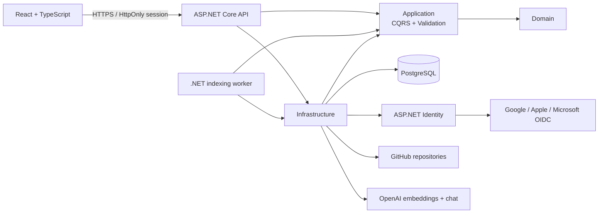

# RepoNav AI

RepoNav AI is an AI-powered engineering workspace for understanding unfamiliar codebases. It is designed to explain request paths, dependencies, architecture, change impact, and technical debt with answers grounded in repository content.

The functional application includes organization-scoped identity and membership, local and configured external sign-in, verified GitHub repository registration, durable restart-safe indexing, polyglot source coverage, architecture exploration, ASP.NET endpoint discovery, pgvector semantic search with commit-pinned citations, guided orientation plans, cited code-flow diagrams, and streamed source-grounded repository chat. A dedicated worker uses PostgreSQL leases and heartbeats to recover interrupted indexing without allowing stale workers to overwrite reclaimed jobs.

See the [product steering document](docs/product/steering.md) for the current capability matrix, limitations, product principles, active investment horizons, and risk register. GitHub Projects remains authoritative for work status; ADRs remain authoritative for durable architecture decisions.

## Architecture



Dependencies point inward. The Domain has no framework dependencies; Application defines use cases and abstractions; Infrastructure implements persistence, repository providers, AI providers, and identity; API and Worker are composition roots. See the [architecture decision records](docs/architecture/), including the clean architecture, tenant isolation, durable indexing, production hosting, infrastructure-as-code, and polyglot-analysis decisions.

The selected production target is Azure Container Apps with Azure Database for PostgreSQL Flexible Server. Bicep infrastructure, dedicated migration execution, container publishing, and digest-based staging/production promotion workflows are present. The [production deployment strategy](docs/operations/production-deployment.md) defines environment configuration, GitHub protection, migrations, monitoring, rollback, and disaster recovery. Local development continues to use Docker Compose.

## Public product preview

The [GitHub Pages preview](https://jeremymwood.github.io/260805-RepoNavAI/) is a read-only walkthrough built from clearly labeled fixture data. It demonstrates the product surface without authentication, repository ingestion, PostgreSQL, OpenAI calls, secrets, or production data. Use the local Docker environment for the functional application; GitHub Pages is not the production hosting target.

## Repository structure

```text
src/
  RepoNavAI.Domain/          Entities and business invariants
  RepoNavAI.Application/     CQRS use cases, ports, validation
  RepoNavAI.Infrastructure/  EF Core, PostgreSQL, Identity, JWT
  RepoNavAI.Api/             HTTP API and composition root
  RepoNavAI.Worker/          Durable repository indexing host
  RepoNavAI.Migrator/        Dedicated database migration job
  RepoNavAI.Web/             React, TypeScript, Vite, Tailwind
tests/
  RepoNavAI.Application.Tests/
  RepoNavAI.Api.IntegrationTests/
docs/architecture/           Architecture decision records
docs/product/                Product direction and capability status
docs/operations/             Deployment and recovery runbooks
docs/testing/                Manual acceptance checks
infra/                       Azure Bicep infrastructure modules
.github/workflows/           Continuous integration
```

## Prerequisites

- .NET SDK 9
- Node.js 22 and npm 10+
- PostgreSQL 17, or Docker with Compose

## Getting started locally

1. Start PostgreSQL and provide configuration via environment variables or [.NET user secrets](https://learn.microsoft.com/aspnet/core/security/app-secrets). Never commit real credentials.
2. From the repository root, run:

   ```bash
   dotnet restore
   dotnet run --project src/RepoNavAI.Api
   ```

3. In a second terminal, run:

   ```bash
   cd src/RepoNavAI.Web
   npm ci
   npm run dev
   ```

The web app is at `http://localhost:5173`; Swagger is at `https://localhost:7248/swagger`. EF migrations run at API startup. Development defaults seed `admin@reponav.local` with password `LocalAdmin!234`; override or remove these credentials outside local development.

Useful configuration keys:

| Setting | Purpose |
| --- | --- |
| `ConnectionStrings__DefaultConnection` | PostgreSQL connection string |
| `Jwt__SigningKey` | JWT HMAC key, minimum 32 characters |
| `Authentication__FrontendUrl` | Trusted browser origin used after an external provider callback |
| `Authentication__Google__ClientId`, `Authentication__Google__ClientSecret` | Enable Google sign-in; store the secret outside source |
| `Authentication__Apple__ClientId`, `Authentication__Apple__ClientSecret` | Enable Sign in with Apple; rotate the signed client secret before expiry |
| `Authentication__Microsoft__ClientId`, `Authentication__Microsoft__ClientSecret` | Enable Microsoft identity platform sign-in |
| `Admin__Email`, `Admin__Password` | Idempotent administrator seed |
| `Cors__AllowedOrigins__0` | Trusted frontend origin |
| `GitHub__AccessToken` | Optional locally for public repositories; required for permitted private repositories |
| `OpenAI__ApiKey` | Required to generate and query semantic-search embeddings; never committed |
| `OpenAI__EmbeddingModel`, `OpenAI__EmbeddingDimensions` | Embedding configuration; defaults to `text-embedding-3-small` and the schema-fixed 512 dimensions |
| `OpenAI__ChatModel`, `OpenAI__ChatMaxOutputTokens` | Repository-chat model and bounded output size; defaults to `gpt-4.1-mini` and 1200 tokens |
| `OpenAI__ChatMaximumContextCharacters` | Maximum retrieved source characters supplied to one answer; defaults to 32,000 |
| `RepositoryChat__OrganizationDailyRequestLimit` | Rolling 24-hour request cap per organization; defaults to 100 |
| `AssistantHistory__RetentionDays`, `AssistantHistory__MaximumEntriesPerUserRepository` | Private assistant-history lifetime and per-user repository count limit |
| `AssistantHistory__MaximumResultBytes`, `AssistantHistory__MaximumOrganizationStoredCharacters` | Saved-result and organization storage boundaries |
| `Indexing__LeaseSeconds`, `Indexing__HeartbeatSeconds` | Worker ownership and recovery timing; defaults to 45 and 10 seconds |
| `Indexing__MaximumDownloadBytes`, `Indexing__MaximumExpandedBytes`, `Indexing__MaximumArchiveEntries` | Compressed, expanded, and entry-count archive safety bounds |
| `Indexing__MaximumFiles`, `Indexing__MaximumFileBytes`, `Indexing__MaximumSnapshotBytes` | Supported-source file count, per-file, and retained snapshot bounds |
| `Indexing__AcquisitionTimeoutSeconds` | End-to-end commit resolution, download, and archive traversal timeout |

## Docker Compose

```bash
cp .env.example .env
# Replace every placeholder in .env
docker compose up --build
```

Open `http://localhost:5173`. PostgreSQL data persists in the `postgres-data` volume. The API waits for PostgreSQL health, applies migrations, and seeds the configured administrator. Compose deliberately has no insecure secret defaults.

Use the [read-only PostgreSQL inspection workflow](docs/operations/database-inspection.md) to examine the local database without exposing a database port or placing credentials in shell history.

Semantic search uses the pgvector-enabled PostgreSQL image. After adding an OpenAI API key, register or explicitly re-index a repository so its immutable snapshot receives embeddings. Repository chat retrieves from the latest indexed snapshot and streams a citation-grounded answer over authenticated server-sent events.

## Current product capabilities

- Local registration/login plus configured Google, Apple, and Microsoft external sign-in through secure, single-use callback exchange
- Organization creation, invitations, owner/administrator/member roles, member administration, and tenant-scoped authorization
- Public and permitted private GitHub repository registration with favorites, durable indexing status, cancellation, retry, re-indexing, and confirmed destructive removal
- Commit-pinned snapshots, archive safety limits, per-language coverage reporting, extensible source analyzers, symbol extraction, and restart recovery through worker leases
- Capability-aware repository navigation for source, documentation, tests, architecture, assistant/search, and detected API endpoints
- Interactive commit-pinned architecture maps with Architecture, Flowchart, and Tree layouts, filtering, focus, collapse, evidence links, and accessible text fallback
- Searchable ASP.NET endpoint catalog with method, route, handler, authorization, downstream-symbol, and source evidence
- Semantic code search backed by OpenAI embeddings and PostgreSQL `pgvector`
- Streamed repository explanations grounded in retrieved evidence with source citations, cancellation, and organization quotas
- Tailored orientation plans with role, experience, focus, time budget, saved progress, and commit-staleness reporting
- Prompted code-flow traces with validated application-owned diagrams, evidence levels, commit-pinned citations, and safe text fallback
- Private per-user assistant history for search, answers, orientation, and code flows with stars, rename, deletion, retention limits, version compatibility, and staleness
- Responsive light, dark, and system themes; accessible loading, outage, recovery, empty, and error states; and visual-regression coverage
- Azure infrastructure and immutable container-promotion foundations, plus a static [public product preview](https://jeremymwood.github.io/260805-RepoNavAI/) that requires no account or secrets

Known limitations and planned investments are maintained in [product steering](docs/product/steering.md), not duplicated here.

## API

- `POST /api/auth/register`: create a standard user and return a JWT
- `POST /api/auth/login`: authenticate and return a JWT
- `GET /api/auth/external/providers`: list configured external sign-in providers
- `GET /api/auth/external/{provider}/challenge`: begin external sign-in
- `POST /api/auth/external/exchange`: redeem a short-lived, single-use callback code
- `POST /api/auth/logout`: expire the browser session cookie
- `GET /api/auth/me`: return the current authenticated principal
- `GET /health`: container/service liveness

The API stores its short-lived JWT in an `HttpOnly`, `SameSite=Strict` browser cookie, marked `Secure` whenever the configured frontend uses HTTPS. Provider callbacks expose only a random two-minute, single-use code; the database stores its SHA-256 hash and atomically consumes it during exchange. Provider access and refresh tokens are not retained.

Google sign-in is operational when its client credentials and exact callback URL are configured. Apple and Microsoft use the same application integration but still require their provider-specific registration, credentials, and live acceptance work tracked on the project board. Existing local accounts are never silently merged with an external identity that presents the same email address.

See the [external authentication operations guide](docs/operations/external-authentication.md) for provider registration, callback URLs, Apple secret rotation, and incident response.

## Quality checks

```bash
dotnet build RepoNavAI.sln --configuration Release
dotnet test RepoNavAI.sln --configuration Release
cd src/RepoNavAI.Web
npm run lint
npm run build
cd ../..
node scripts/validate-docs.mjs
node --test scripts/validate-prose.test.mjs
node scripts/validate-prose.mjs
```

GitHub Actions runs these checks for pushes to `main` and pull requests.

Feature-level browser checks are maintained in the [manual acceptance runbook](docs/testing/manual-acceptance.md). These checks complement automated tests for streaming, provider integration, source links, responsive layout, and other behavior that benefits from end-to-end human verification.

## Roadmap

The [GitHub project](https://github.com/users/jeremymwood/projects/14) is authoritative for current priority and delivery state. The living [product steering document](docs/product/steering.md) records product principles, limitations, risks, and longer-range direction; completed capabilities are summarized here instead of repeated as future work.

Organization membership is the tenant boundary. All future project and repository operations must retain the tenant-scoped authorization model documented in ADR-002.
