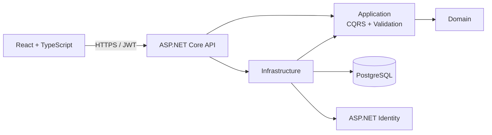

# RepoNav AI

RepoNav AI is an AI-powered engineering workspace for understanding unfamiliar codebases. It is designed to explain request paths, dependencies, architecture, change impact, and technical debt with answers grounded in repository content.

The current foundation includes a Clean Architecture backend, PostgreSQL persistence, ASP.NET Identity, JWT authentication, structured logging, a polished React workspace shell, organization-scoped tenancy, and verified GitHub repository registration.

## Architecture



Dependencies point inward. The Domain has no framework dependencies; Application defines use cases and abstractions; Infrastructure implements persistence and identity; API is the composition root. See [ADR-001](docs/architecture/ADR-001-clean-architecture.md), [ADR-002](docs/architecture/ADR-002-organization-tenancy.md), [ADR-003](docs/architecture/ADR-003-github-repository-registration.md), and [ADR-004](docs/architecture/ADR-004-durable-repository-indexing.md).

## Repository structure

```text
src/
  RepoNavAI.Domain/          Entities and business invariants
  RepoNavAI.Application/     CQRS use cases, ports, validation
  RepoNavAI.Infrastructure/  EF Core, PostgreSQL, Identity, JWT
  RepoNavAI.Api/             HTTP API and composition root
  RepoNavAI.Web/             React, TypeScript, Vite, Tailwind
tests/
  RepoNavAI.Application.Tests/
  RepoNavAI.Api.IntegrationTests/
docs/architecture/           Architecture decision records
.github/workflows/           Continuous integration
```

## Prerequisites

- .NET SDK 9
- Node.js 22 and npm 10+
- PostgreSQL 17, or Docker with Compose

## Getting started locally

1. Start PostgreSQL and provide configuration via environment variables or [.NET user secrets](https://learn.microsoft.com/aspnet/core/security/app-secrets). Never commit real credentials.
2. From the repository root, run:

   ```bash
   dotnet restore
   dotnet run --project src/RepoNavAI.Api
   ```

3. In a second terminal, run:

   ```bash
   cd src/RepoNavAI.Web
   npm ci
   npm run dev
   ```

The web app is at `http://localhost:5173`; Swagger is at `https://localhost:7248/swagger`. EF migrations run at API startup. Development defaults seed `admin@reponav.local` with password `LocalAdmin!234`; override or remove these credentials outside local development.

Useful configuration keys:

| Setting | Purpose |
| --- | --- |
| `ConnectionStrings__DefaultConnection` | PostgreSQL connection string |
| `Jwt__SigningKey` | JWT HMAC key, minimum 32 characters |
| `Admin__Email`, `Admin__Password` | Idempotent administrator seed |
| `Cors__AllowedOrigins__0` | Trusted frontend origin |
| `GitHub__AccessToken` | Optional locally for public repositories; required for permitted private repositories |

## Docker Compose

```bash
cp .env.example .env
# Replace every placeholder in .env
docker compose up --build
```

Open `http://localhost:5173`. PostgreSQL data persists in the `postgres-data` volume. The API waits for PostgreSQL health, applies migrations, and seeds the configured administrator. Compose deliberately has no insecure secret defaults.

## API

- `POST /api/auth/register` — create a standard user and return a JWT
- `POST /api/auth/login` — authenticate and return a JWT
- `GET /api/auth/me` — return the current authenticated principal
- `GET /health` — container/service liveness

Tokens are stored in browser session storage for this phase. Production hardening should move to short-lived access tokens plus rotating, HttpOnly, Secure refresh cookies so sessions can be revoked without exposing long-lived credentials to JavaScript.

## Quality checks

```bash
dotnet build RepoNavAI.sln --configuration Release
dotnet test RepoNavAI.sln --configuration Release
cd src/RepoNavAI.Web
npm run lint
npm run build
```

GitHub Actions runs these checks for pushes to `main` and pull requests.

## Roadmap

1. Repository-provider credentials and webhook security
2. Webhook-driven re-indexing and additional language analyzers
3. Chunking, embeddings, vector-store abstraction, and semantic search
4. Streaming repository chat with citations and RAG evaluation
5. Architecture summaries and dependency graphs
6. Documentation and technical-debt analysis
7. Test/refactoring suggestions, health dashboards, and administration

Organization membership is the tenant boundary. All future project and repository operations must retain the tenant-scoped authorization model documented in ADR-002.
