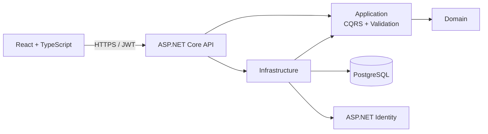

# RepoNav AI

RepoNav AI is an AI-powered engineering workspace for understanding unfamiliar codebases. It is designed to explain request paths, dependencies, architecture, change impact, and technical debt with answers grounded in repository content.

The functional MVP includes organization-scoped authentication and membership, verified GitHub repository registration, durable restart-safe indexing, ASP.NET endpoint discovery, pgvector semantic search with commit-pinned citations, and streamed source-grounded repository chat. A PostgreSQL-backed lease and heartbeat model recovers interrupted indexing without allowing stale workers to overwrite reclaimed jobs.

See the [product steering document](docs/product/steering.md) for the current capability matrix, limitations, product principles, active investment horizons, and risk register. GitHub Projects remains authoritative for work status; ADRs remain authoritative for durable architecture decisions.

## Architecture



Dependencies point inward. The Domain has no framework dependencies; Application defines use cases and abstractions; Infrastructure implements persistence and identity; API is the composition root. See [ADR-001](docs/architecture/ADR-001-clean-architecture.md), [ADR-002](docs/architecture/ADR-002-organization-tenancy.md), [ADR-003](docs/architecture/ADR-003-github-repository-registration.md), [ADR-004](docs/architecture/ADR-004-durable-repository-indexing.md), [ADR-005](docs/architecture/ADR-005-api-endpoint-catalog.md), [ADR-006](docs/architecture/ADR-006-semantic-search.md), [ADR-007](docs/architecture/ADR-007-streaming-repository-chat.md), and [ADR-008](docs/architecture/ADR-008-production-hosting.md).

The selected production target is Azure Container Apps with Azure Database for PostgreSQL Flexible Server. The [production deployment strategy](docs/operations/production-deployment.md) defines environment promotion, GitHub protection, migrations, monitoring, rollback, and disaster recovery. Azure provisioning and runtime deployment remain explicit follow-up work; local development continues to use Docker Compose.

## Public product preview

The [GitHub Pages preview](https://jeremymwood.github.io/260805-RepoNavAI/) is a read-only walkthrough built from clearly labeled fixture data. It demonstrates the product surface without authentication, repository ingestion, PostgreSQL, OpenAI calls, secrets, or production data. Use the local Docker environment for the functional application; GitHub Pages is not the production hosting target.

## Repository structure

```text
src/
  RepoNavAI.Domain/          Entities and business invariants
  RepoNavAI.Application/     CQRS use cases, ports, validation
  RepoNavAI.Infrastructure/  EF Core, PostgreSQL, Identity, JWT
  RepoNavAI.Api/             HTTP API and composition root
  RepoNavAI.Web/             React, TypeScript, Vite, Tailwind
tests/
  RepoNavAI.Application.Tests/
  RepoNavAI.Api.IntegrationTests/
docs/architecture/           Architecture decision records
docs/product/                Product direction and capability status
docs/operations/             Deployment and recovery runbooks
docs/testing/                Manual acceptance checks
.github/workflows/           Continuous integration
```

## Prerequisites

- .NET SDK 9
- Node.js 22 and npm 10+
- PostgreSQL 17, or Docker with Compose

## Getting started locally

1. Start PostgreSQL and provide configuration via environment variables or [.NET user secrets](https://learn.microsoft.com/aspnet/core/security/app-secrets). Never commit real credentials.
2. From the repository root, run:

   ```bash
   dotnet restore
   dotnet run --project src/RepoNavAI.Api
   ```

3. In a second terminal, run:

   ```bash
   cd src/RepoNavAI.Web
   npm ci
   npm run dev
   ```

The web app is at `http://localhost:5173`; Swagger is at `https://localhost:7248/swagger`. EF migrations run at API startup. Development defaults seed `admin@reponav.local` with password `LocalAdmin!234`; override or remove these credentials outside local development.

Useful configuration keys:

| Setting | Purpose |
| --- | --- |
| `ConnectionStrings__DefaultConnection` | PostgreSQL connection string |
| `Jwt__SigningKey` | JWT HMAC key, minimum 32 characters |
| `Admin__Email`, `Admin__Password` | Idempotent administrator seed |
| `Cors__AllowedOrigins__0` | Trusted frontend origin |
| `GitHub__AccessToken` | Optional locally for public repositories; required for permitted private repositories |
| `OpenAI__ApiKey` | Required to generate and query semantic-search embeddings; never committed |
| `OpenAI__EmbeddingModel`, `OpenAI__EmbeddingDimensions` | Embedding configuration; defaults to `text-embedding-3-small` and the schema-fixed 512 dimensions |
| `OpenAI__ChatModel`, `OpenAI__ChatMaxOutputTokens` | Repository-chat model and bounded output size; defaults to `gpt-4.1-mini` and 1200 tokens |
| `OpenAI__ChatMaximumContextCharacters` | Maximum retrieved source characters supplied to one answer; defaults to 32,000 |
| `RepositoryChat__OrganizationDailyRequestLimit` | Rolling 24-hour request cap per organization; defaults to 100 |
| `AssistantHistory__RetentionDays`, `AssistantHistory__MaximumEntriesPerUserRepository` | Private assistant-history lifetime and per-user repository count limit |
| `AssistantHistory__MaximumResultBytes`, `AssistantHistory__MaximumOrganizationStoredCharacters` | Saved-result and organization storage boundaries |
| `Indexing__LeaseSeconds`, `Indexing__HeartbeatSeconds` | Worker ownership and recovery timing; defaults to 45 and 10 seconds |
| `Indexing__MaximumDownloadBytes`, `Indexing__MaximumExpandedBytes`, `Indexing__MaximumArchiveEntries` | Compressed, expanded, and entry-count archive safety bounds |
| `Indexing__MaximumFiles`, `Indexing__MaximumFileBytes`, `Indexing__MaximumSnapshotBytes` | Supported-source file count, per-file, and retained snapshot bounds |
| `Indexing__AcquisitionTimeoutSeconds` | End-to-end commit resolution, download, and archive traversal timeout |

## Docker Compose

```bash
cp .env.example .env
# Replace every placeholder in .env
docker compose up --build
```

Open `http://localhost:5173`. PostgreSQL data persists in the `postgres-data` volume. The API waits for PostgreSQL health, applies migrations, and seeds the configured administrator. Compose deliberately has no insecure secret defaults.

Use the [read-only PostgreSQL inspection workflow](docs/operations/database-inspection.md) to examine the local database without exposing a database port or placing credentials in shell history.

Semantic search uses the pgvector-enabled PostgreSQL image. After adding an OpenAI API key, register or explicitly re-index a repository so its immutable snapshot receives embeddings. Repository chat retrieves from the latest indexed snapshot and streams a citation-grounded answer over authenticated server-sent events.

## Current product capabilities

- Organization creation, invitations, owner/administrator/member roles, and tenant-scoped authorization
- Public and permitted private GitHub repository registration with durable indexing status, cancellation, retry, and re-indexing
- Commit-pinned source snapshots, supported-file parsing, C# symbol extraction, and restart recovery within the indexing lease window
- ASP.NET endpoint catalog with method, route, handler, authorization, downstream-symbol, and source filters
- Semantic code search backed by OpenAI embeddings and PostgreSQL `pgvector`
- Streamed repository explanations grounded in retrieved evidence with source citations, cancellation, and organization quotas
- Private per-user assistant history with saved-result stars, rename, deletion, version compatibility, and commit staleness
- A static [public product preview](https://jeremymwood.github.io/260805-RepoNavAI/) that requires no account or secrets

Known limitations and planned investments are maintained in [product steering](docs/product/steering.md), not duplicated here.

## API

- `POST /api/auth/register`: create a standard user and return a JWT
- `POST /api/auth/login`: authenticate and return a JWT
- `GET /api/auth/me`: return the current authenticated principal
- `GET /health`: container/service liveness

Tokens are stored in browser session storage for this phase. Production hardening should move to short-lived access tokens plus rotating, HttpOnly, Secure refresh cookies so sessions can be revoked without exposing long-lived credentials to JavaScript.

## Quality checks

```bash
dotnet build RepoNavAI.sln --configuration Release
dotnet test RepoNavAI.sln --configuration Release
cd src/RepoNavAI.Web
npm run lint
npm run build
cd ../..
node scripts/validate-docs.mjs
node --test scripts/validate-prose.test.mjs
node scripts/validate-prose.mjs
```

GitHub Actions runs these checks for pushes to `main` and pull requests.

Feature-level browser checks are maintained in the [manual acceptance runbook](docs/testing/manual-acceptance.md). These checks complement automated tests for streaming, provider integration, source links, responsive layout, and other behavior that benefits from end-to-end human verification.

## Roadmap

The living [Now / Next / Later direction](docs/product/steering.md#direction) links directly to scoped GitHub work items. Near-term product investment focuses on tailored codebase orientation, capability-aware repository exploration, safe repository removal, and prompted code-flow maps with citations. Platform work then separates indexing from API scaling and provisions the selected Azure staging/production path.

Organization membership is the tenant boundary. All future project and repository operations must retain the tenant-scoped authorization model documented in ADR-002.
