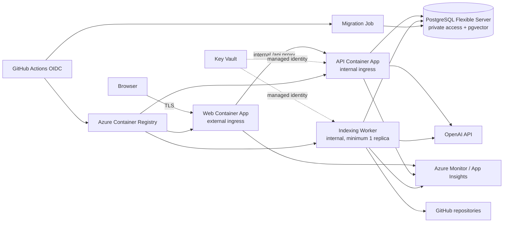

# ADR-008: Azure Container Apps production hosting

## Status

Accepted

## Context

RepoNavAI needs a production target for its React/nginx frontend, ASP.NET Core API, repository-indexing workload, PostgreSQL database with `pgvector`, secrets, and telemetry. The platform must support low initial traffic without creating an operational dead end, and deployment must preserve tenant isolation and permit a safe rollback.

The current API also hosts the indexing poller. Running multiple API replicas would therefore couple HTTP scaling to background-work concurrency. Production readiness requires a separate worker executable before horizontal API scaling.

## Decision

Use Microsoft Azure with these boundaries:

- One Azure Container Apps environment per deployment environment. The web app has external ingress; the API and indexing worker use internal ingress/service discovery. nginx proxies browser `/api` traffic to the API, so the API does not need a separate public origin.
- Azure Container Registry stores deployable images. GitHub Actions authenticates to Azure with OpenID Connect (OIDC), imports or publishes the immutable commit-SHA images, and deploys by digest. Container Apps pulls from ACR through managed identity.
- Azure Database for PostgreSQL Flexible Server stores application and vector data. `vector` is allow-listed and enabled. Staging uses a small single-zone server; production starts single-zone and enables zone-redundant high availability when the availability objective or usage justifies it.
- Azure Key Vault owns application secrets. Container Apps uses managed identities and Key Vault secret references; credentials are not copied into repository or long-lived GitHub secrets.
- A one-off Azure Container Apps Job applies migrations once, before traffic promotion. Production does not run migrations independently in every API replica.
- Azure Monitor, Log Analytics, and Application Insights collect structured logs, metrics, traces, and deployment events. Alerts cover availability, error rate, latency, failed jobs, queue/lease age, database capacity, and backup health.

Container Apps supports KEDA-based scaling, revision traffic splitting, internal service discovery, managed identity, and scale-to-zero. The web and API begin at zero or one minimum replica according to measured cold-start tolerance. The polling worker begins at one replica; scale-out remains disabled until it is separated from the API and lease-heartbeat work is complete. PostgreSQL is the first expected fixed-cost floor.

## Options considered

| Option | Strengths | Tradeoffs | Result |
| --- | --- | --- | --- |
| Azure Container Apps + PostgreSQL Flexible Server | Native .NET ecosystem, managed identity/Key Vault, private networking, revisions, jobs, mature monitoring and managed PostgreSQL HA/PITR | More resources and policy to configure; managed database costs more than hobby platforms | Selected for the production path |
| Render | Fast setup, background workers, managed PostgreSQL with `pgvector` and PITR on paid plans | Less granular identity, network, and enterprise governance; fewer promotion primitives | Good prototype/small-team fallback |
| Fly.io | Strong global container placement, inexpensive compute, managed PostgreSQL supports `pgvector` | More platform/network operations; managed PostgreSQL has a meaningful minimum cost and self-managed Fly Postgres is unsupported | Not selected |
| Single virtual machine with Docker Compose | Lowest conceptual and initial hosting cost | Patching, failover, secret handling, backups, deployment coordination, and scaling become application-team responsibilities | Rejected for production |

## Ownership, cost, and scaling assumptions

The application/platform owner owns IaC, deployment workflows, access reviews, alerts, restore tests, and cost budgets. Azure owns physical infrastructure and the managed services' platform availability; the team still owns schema safety, capacity, data retention, and recovery validation.

Planning estimates in USD per month, excluding OpenAI usage, source-provider API charges, domain registration, tax, and unusually high egress:

- staging: **$40–$100**, with scale-to-zero application containers and a small single-zone database;
- low-traffic production: **$100–$250**, with modest always-ready capacity and a single-zone managed database;
- production with zone-redundant database HA, multiple always-ready application replicas, and longer telemetry retention: **$250–$600+**.

These are budget bands, not quotes. Region, database compute/storage, log volume, and minimum replicas dominate cost and must be confirmed in the [Azure pricing calculator](https://azure.microsoft.com/en-us/pricing/calculator/) before provisioning. Budgets and 50/80/100-percent alerts are mandatory.

Initial capacity assumes fewer than 100 organizations, low concurrent chat traffic, one indexing worker, and tens of gigabytes of database/vector storage. Scale API replicas on HTTP concurrency and CPU; scale workers only after measuring backlog and validating leases; vertically scale PostgreSQL before adding read replicas because current writes and vector queries use one primary.

## Security and reliability

- Production and staging use separate resource groups and identities; production should move to a separate subscription when multiple operators or compliance needs justify the boundary.
- PostgreSQL uses private networking, TLS, least-privilege application and migration identities, automated backups, and point-in-time restore. Public access is disabled.
- GitHub receives federated deployment identities scoped to one environment. No Azure client secret is stored in GitHub.
- Custom domains terminate TLS through Container Apps managed certificates initially. Azure Front Door/WAF is deferred until global routing, edge caching, or a stronger web application firewall requirement exists.
- Initial production targets are RPO at most 15 minutes and RTO at most 4 hours. A quarterly restore exercise validates that backups, extensions, migrations, and secrets recreate a working isolated environment.

## Deployment and rollback

Images and application revisions are immutable. Staging automatically receives a successful `main` image, then runs migration, health, authentication, indexing, search, and chat smoke checks. Production requires approval and promotes the exact tested image digests.

Application rollout uses a new Container Apps revision with readiness checks, then shifts traffic gradually. Failed application releases shift traffic to the previous healthy revision. Database changes follow expand/migrate/contract: every production migration must be backward-compatible with both the previous and new application revisions. Destructive contraction is a later release after rollback is no longer required; database restore is a disaster-recovery action, not the normal application rollback.

## Consequences

- The selected architecture costs more than a hobby PaaS but provides an enterprise-ready identity, network, observability, and recovery model.
- Infrastructure as code, worker separation, and runtime deployment workflows are required follow-up work before a production launch.
- Local Docker Compose remains the developer environment and is not treated as a production topology.
- The design can add Front Door, database HA, more replicas, and queue-driven indexing without replacing the hosting platform.

## References

- [Azure Container Apps environments](https://learn.microsoft.com/en-us/azure/container-apps/environment)
- [Azure Container Apps scaling](https://learn.microsoft.com/en-us/azure/container-apps/scale-app)
- [Azure Container Apps jobs](https://learn.microsoft.com/en-us/azure/container-apps/jobs)
- [GitHub Actions authentication to Azure with OIDC](https://learn.microsoft.com/en-us/azure/developer/github/connect-from-azure-openid-connect)
- [GitHub deployment environments](https://docs.github.com/en/actions/reference/workflows-and-actions/deployments-and-environments)
- [Azure Database for PostgreSQL high availability](https://learn.microsoft.com/en-us/azure/postgresql/flexible-server/concepts-high-availability)
- [Azure Database for PostgreSQL backup and restore](https://learn.microsoft.com/en-us/azure/postgresql/backup-restore/concepts-backup-restore)
- [Render background workers](https://render.com/docs/background-workers) and [PostgreSQL](https://render.com/docs/postgresql)
- [Fly.io Managed Postgres](https://fly.io/docs/mpg/) and [pricing](https://fly.io/docs/about/pricing/)
