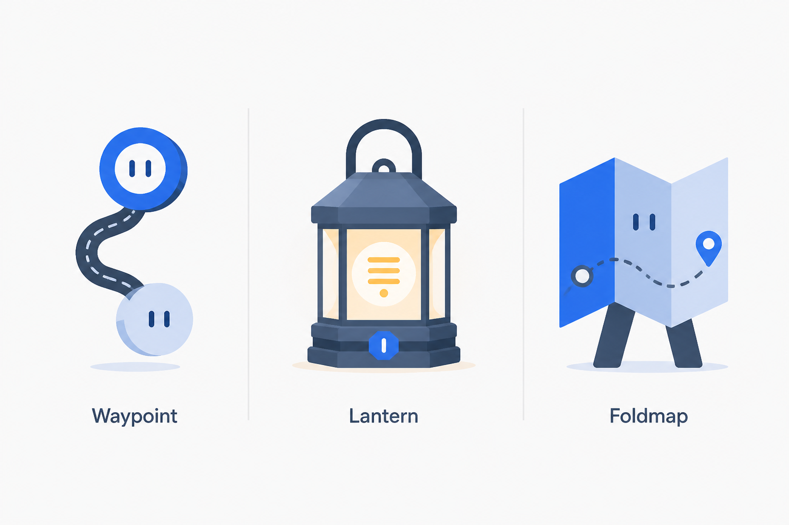

# RepoNavAI guide-character direction

## Decision

Approve **Waypoint** as a constrained guide motif for production prototyping. It is not a speaking mascot, assistant identity, logo replacement, or loading indicator. Its role is to add a small amount of product character where a visual cue can help someone choose a next step.

The concept sheet is exploratory artwork generated for this decision. It is not a production asset and must not be shipped, traced, or treated as a final source file.

## Concepts considered

| Direction | Product role | Strengths | Risks | Decision |
| --- | --- | --- | --- | --- |
| Waypoint | Optional onboarding callouts and actionable empty states | Connects navigation, code paths, and progress without implying that the product is a person; remains legible as a simple silhouette | A face or exaggerated motion could make it feel childish; a route line could be mistaken for live progress | Advance with strict boundaries |
| Lantern | Evidence-discovery moments and educational tips | Communicates finding and illuminating source evidence; warm accent offers a distinct focal point | Too detailed at small sizes; light can imply an active or successful system state | Do not advance |
| Foldmap | First-run repository orientation | Directly communicates navigation and exploration | Literal map metaphor does not fit every repository task; character legs add unnecessary personality | Do not advance |

## Usage boundaries

Waypoint may appear only in:

- first-run onboarding that explains how to register or explore a repository;
- empty states with a useful next action;
- optional, dismissible product education.

Waypoint must not:

- replace the RepoNavAI wordmark, application icon, status icon, or standard Lucide icons;
- represent the AI model, speak in the first person, claim emotions, or imply human judgment;
- appear in errors, destructive confirmations, security or authorization messages, legal content, or evidence citations;
- communicate loading, indexing progress, success, failure, or any other system status;
- obstruct controls, compete with source evidence, or become necessary to understand or complete a task;
- use autonomous movement, speech bubbles, costumes, or seasonal brand variants.

The production form should be a simpler vector interpretation of the two connected nodes and route, without a face. Use semantic theme tokens rather than fixed colors. The mark must remain recognizable in monochrome, but its meaning must never depend on color or the illustration alone.

## Accessibility and motion

- Every use needs adjacent visible text that communicates the same meaning and action. Treat the artwork as decorative with empty alternative text, or hide it from assistive technology.
- Do not place information, focus targets, or controls inside the artwork.
- Verify contrast for any non-decorative boundary against both light and dark surfaces.
- Keep the layout usable when the artwork is hidden, fails to load, or is enlarged to 200%.
- The default production asset is static. If motion is proposed later, limit it to a short user-triggered emphasis, stop it automatically, and remove it entirely under `prefers-reduced-motion: reduce`.
- Loading and progress continue to use accessible text, `role="status"` or appropriate live regions, and existing reduced-motion-safe indicators. Waypoint never substitutes for those mechanics.

## Originality and licensing

The directions were prompted as generic geometric objects and explicitly excluded existing mascots, brands, logos, protected characters, and trade dress. Waypoint avoids animal, human, and robot conventions and is intentionally based on ordinary nodes and a path.

Generation alone does not establish exclusivity or trademark clearance. Before public production use:

1. recreate the selected direction as original project-owned vector artwork rather than shipping or tracing the generated preview;
2. retain the editable source, author, date, license or assignment, and export history in the repository;
3. perform visual-similarity and trademark review appropriate to the intended markets;
4. review third-party fonts, textures, and tools used during production and record their licenses;
5. keep the name **Waypoint** descriptive and internal unless naming clearance is completed.

## Production follow-up

Production work is intentionally separate from this discovery. [Issue #77](https://github.com/jeremymwood/260805-RepoNavAI/issues/77) will create a small, project-owned static vector set, test light and dark themes plus narrow viewports, validate non-visual equivalents, and introduce the motif in no more than one onboarding and one empty-state surface before broader adoption.
